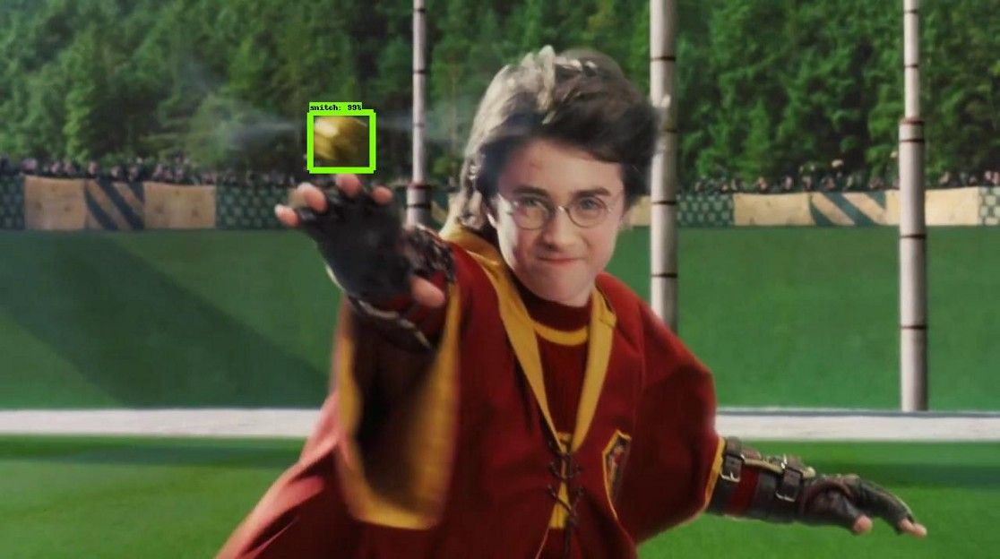

# Object Detection Quidditch
Playing Quidditch using the TensorFlow Object Detection API

Checkout this [post](https://medium.freecodecamp.org/how-to-play-quidditch-using-the-tensorflow-object-detection-api-b0742b99065d) for instructions on how to use this repo.

Click [here](https://www.youtube.com/watch?v=j0cjLNnLNYA) to see it in action.

  

